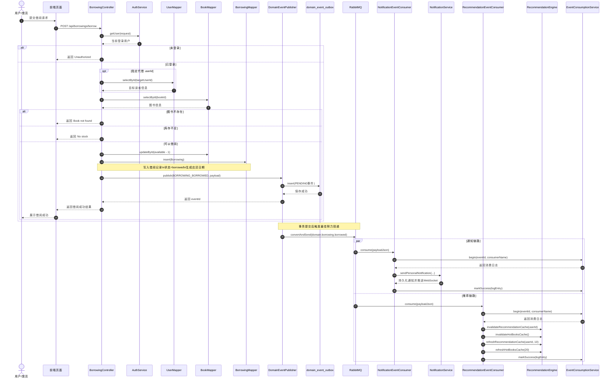

```mermaid
```mermaid
sequenceDiagram
    autonumber
    actor U as 用户/馆员
    participant F as 前端页面
    participant C as BorrowingController
    participant A as AuthService
    participant UM as UserMapper
    participant BM as BookMapper
    participant BRM as BorrowingMapper
    participant P as DomainEventPublisher
    participant O as domain_event_outbox
    participant MQ as RabbitMQ
    participant NC as NotificationEventConsumer
    participant NS as NotificationService
    participant RC as RecommendationEventConsumer
    participant RE as RecommendationEngine
    participant ECS as EventConsumptionService

    U->>F: 提交借阅请求
    F->>C: POST /api/borrowings/borrow

    C->>A: getUser(request)
    A-->>C: 当前登录用户

    alt 未登录
        C-->>F: 返回 Unauthorized
    else 已登录
        opt 指定代借 userId
            C->>UM: selectById(targetUserId)
            UM-->>C: 目标读者信息
        end

        C->>BM: selectById(bookId)
        BM-->>C: 图书信息

        alt 图书不存在
            C-->>F: 返回 Book not found
        else 库存不足
            C-->>F: 返回 No stock
        else 可以借阅
            C->>BM: updateById(available - 1)
            C->>BRM: insert(Borrowing)
            Note over C,BRM: 写入借阅记录\n状态=borrowed\n生成应还日期

            C->>P: publish(BORROWING_BORROWED, payload)
            P->>O: insert(PENDING事件)
            O-->>P: 保存成功
            P-->>C: 返回 eventId

            C-->>F: 返回借阅成功结果
            F-->>U: 展示借阅成功
        end
    end

    Note over P,MQ: 事务提交后触发最佳努力投递

    P->>MQ: convertAndSend(domain.borrowing.borrowed)

    par 通知链路
        MQ->>NC: consume(payloadJson)
        NC->>ECS: begin(eventId, consumerName)
        ECS-->>NC: 返回消费日志
        NC->>NS: sendPersonalNotification(...)
        NS-->>NC: 持久化通知并推送WebSocket
        NC->>ECS: markSuccess(logEntry)
    and 推荐链路
        MQ->>RC: consume(payloadJson)
        RC->>ECS: begin(eventId, consumerName)
        ECS-->>RC: 返回消费日志
        RC->>RE: invalidateRecommendationCache(userId)
        RC->>RE: invalidateHotBooksCache()
        RC->>RE: refreshRecommendationCache(userId, 10)
        RC->>RE: refreshHotBooksCache(20)
        RC->>ECS: markSuccess(logEntry)
    end

```
```