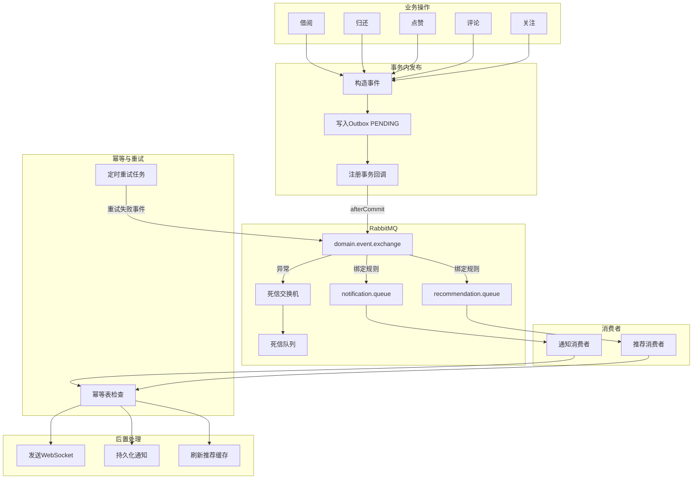

```mermaid
graph TD
    subgraph 业务操作
        op1[借阅]
        op2[归还]
        op3[点赞]
        op4[评论]
        op5[关注]
    end

    subgraph 事务内发布
        pub1[构造事件]
        pub2[写入Outbox PENDING]
        pub3[注册事务回调]
    end

    subgraph RabbitMQ
        ex[domain.event.exchange]
        q1[notification.queue]
        q2[recommendation.queue]
        dlx[死信交换机]
        dlq[死信队列]
    end

    subgraph 消费者
        c1[通知消费者]
        c2[推荐消费者]
    end

    subgraph 幂等与重试
        idem[幂等表检查]
        retry[定时重试任务]
    end

    subgraph 后置处理
        action1[发送WebSocket]
        action2[持久化通知]
        action3[刷新推荐缓存]
    end

    op1 --> pub1
    op2 --> pub1
    op3 --> pub1
    op4 --> pub1
    op5 --> pub1

    pub1 --> pub2
    pub2 --> pub3

    pub3 -->|afterCommit| ex

    ex -->|绑定规则| q1
    ex -->|绑定规则| q2

    q1 --> c1
    q2 --> c2

    c1 --> idem
    c2 --> idem

    idem --> action1
    idem --> action2
    idem --> action3

    retry -->|重试失败事件| ex

    ex -->|异常| dlx
    dlx --> dlq
```