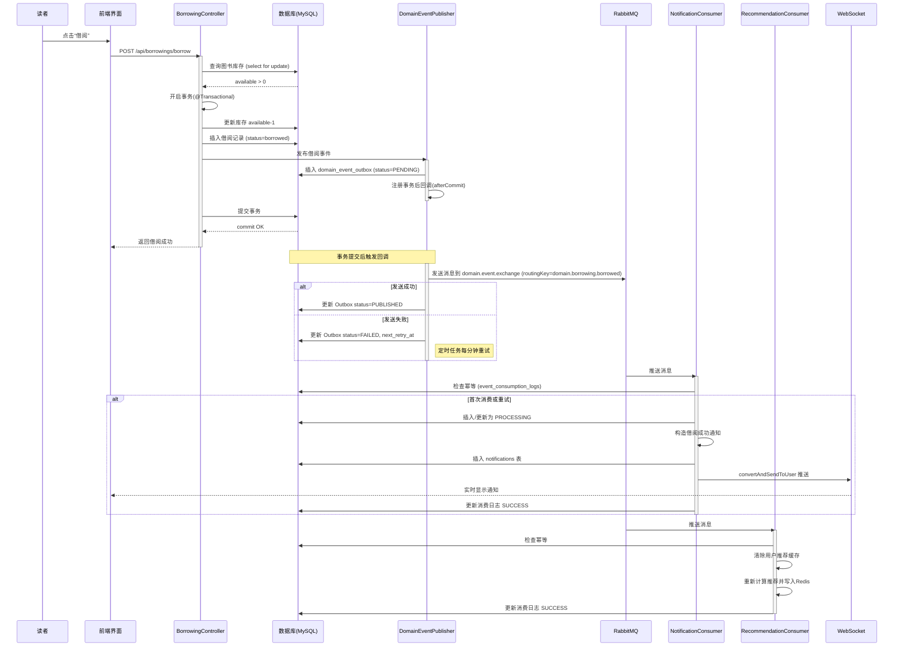

```mermaid
sequenceDiagram
    participant 读者 as 读者
    participant 前端 as 前端界面
    participant Controller as BorrowingController
    participant DB as 数据库(MySQL)
    participant Publisher as DomainEventPublisher
    participant MQ as RabbitMQ
    participant NotifConsumer as NotificationConsumer
    participant RecConsumer as RecommendationConsumer
    participant WS as WebSocket

    读者->>前端: 点击“借阅”
    前端->>Controller: POST /api/borrowings/borrow
    activate Controller
    Controller->>DB: 查询图书库存 (select for update)
    DB-->>Controller: available > 0
    Controller->>Controller: 开启事务(@Transactional)
    Controller->>DB: 更新库存 available-1
    Controller->>DB: 插入借阅记录 (status=borrowed)
    Controller->>Publisher: 发布借阅事件
    activate Publisher
    Publisher->>DB: 插入 domain_event_outbox (status=PENDING)
    Publisher->>Publisher: 注册事务后回调(afterCommit)
    deactivate Publisher
    Controller->>DB: 提交事务
    DB-->>Controller: commit OK
    Controller-->>前端: 返回借阅成功
    deactivate Controller

    Note over Publisher,DB: 事务提交后触发回调
    activate Publisher
    Publisher->>MQ: 发送消息到 domain.event.exchange (routingKey=domain.borrowing.borrowed)
    alt 发送成功
        Publisher->>DB: 更新 Outbox status=PUBLISHED
    else 发送失败
        Publisher->>DB: 更新 Outbox status=FAILED, next_retry_at
        Note right of Publisher: 定时任务每分钟重试
    end
    deactivate Publisher

    MQ->>NotifConsumer: 推送消息
    activate NotifConsumer
    NotifConsumer->>DB: 检查幂等 (event_consumption_logs)
    alt 首次消费或重试
        NotifConsumer->>DB: 插入/更新为 PROCESSING
        NotifConsumer->>NotifConsumer: 构造借阅成功通知
        NotifConsumer->>DB: 插入 notifications 表
        NotifConsumer->>WS: convertAndSendToUser 推送
        WS-->>前端: 实时显示通知
        NotifConsumer->>DB: 更新消费日志 SUCCESS
    end
    deactivate NotifConsumer

    MQ->>RecConsumer: 推送消息
    activate RecConsumer
    RecConsumer->>DB: 检查幂等
    RecConsumer->>RecConsumer: 清除用户推荐缓存
    RecConsumer->>RecConsumer: 重新计算推荐并写入Redis
    RecConsumer->>DB: 更新消费日志 SUCCESS
    deactivate RecConsumer
```