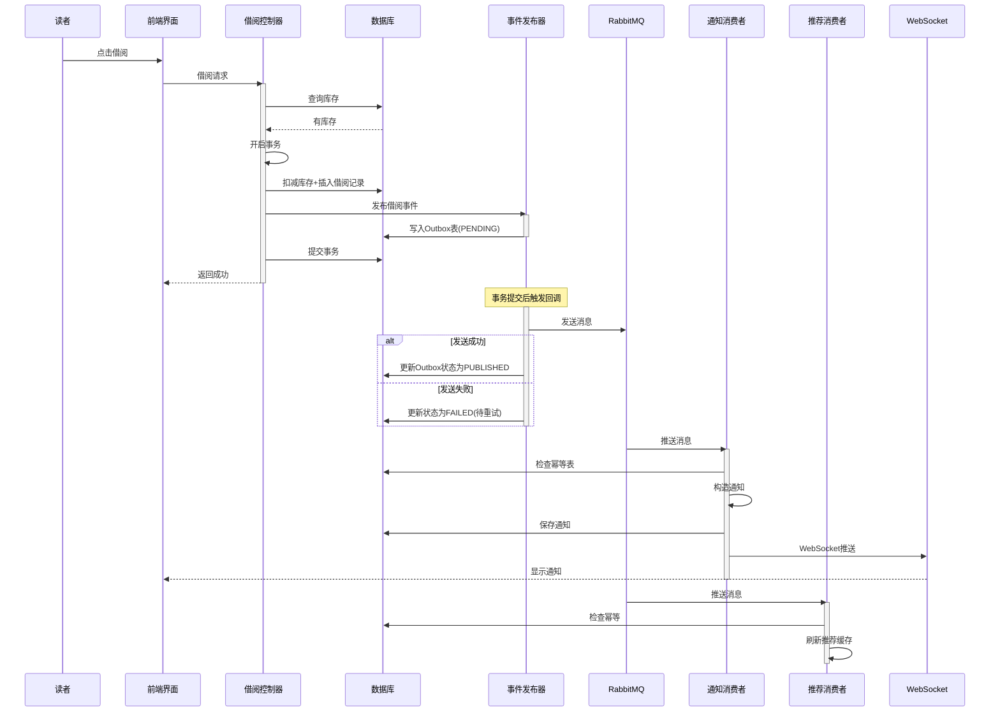

```mermaid
sequenceDiagram
    participant Reader as 读者
    participant Web as 前端界面
    participant Ctrl as 借阅控制器
    participant DB as 数据库
    participant Pub as 事件发布器
    participant MQ as RabbitMQ
    participant Notif as 通知消费者
    participant Rec as 推荐消费者
    participant WS as WebSocket

    Reader->>Web: 点击借阅
    Web->>Ctrl: 借阅请求
    activate Ctrl
    Ctrl->>DB: 查询库存
    DB-->>Ctrl: 有库存
    Ctrl->>Ctrl: 开启事务
    Ctrl->>DB: 扣减库存+插入借阅记录
    Ctrl->>Pub: 发布借阅事件
    activate Pub
    Pub->>DB: 写入Outbox表(PENDING)
    deactivate Pub
    Ctrl->>DB: 提交事务
    Ctrl-->>Web: 返回成功
    deactivate Ctrl

    Note over Pub: 事务提交后触发回调
    activate Pub
    Pub->>MQ: 发送消息
    alt 发送成功
        Pub->>DB: 更新Outbox状态为PUBLISHED
    else 发送失败
        Pub->>DB: 更新状态为FAILED(待重试)
    end
    deactivate Pub

    MQ->>Notif: 推送消息
    activate Notif
    Notif->>DB: 检查幂等表
    Notif->>Notif: 构造通知
    Notif->>DB: 保存通知
    Notif->>WS: WebSocket推送
    WS-->>Web: 显示通知
    deactivate Notif

    MQ->>Rec: 推送消息
    activate Rec
    Rec->>DB: 检查幂等
    Rec->>Rec: 刷新推荐缓存
    deactivate Rec
```