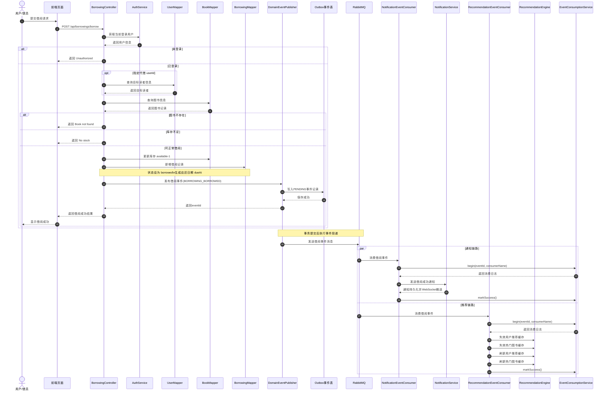

```mermaid
```mermaid
sequenceDiagram
    autonumber
    actor U as 用户/馆员
    participant F as 前端页面
    participant C as BorrowingController
    participant A as AuthService
    participant UM as UserMapper
    participant BM as BookMapper
    participant BRM as BorrowingMapper
    participant P as DomainEventPublisher
    participant O as Outbox事件表
    participant MQ as RabbitMQ
    participant NC as NotificationEventConsumer
    participant NS as NotificationService
    participant RC as RecommendationEventConsumer
    participant RE as RecommendationEngine
    participant ECS as EventConsumptionService

    U->>F: 提交借阅请求
    F->>C: POST /api/borrowings/borrow
    C->>A: 获取当前登录用户
    A-->>C: 返回用户信息

    alt 未登录
        C-->>F: 返回 Unauthorized
    else 已登录
        opt 指定代借 userId
            C->>UM: 查询目标读者信息
            UM-->>C: 返回目标读者
        end

        C->>BM: 查询图书信息
        BM-->>C: 返回图书记录

        alt 图书不存在
            C-->>F: 返回 Book not found
        else 库存不足
            C-->>F: 返回 No stock
        else 可正常借阅
            C->>BM: 更新库存 available-1
            C->>BRM: 新增借阅记录
            Note over C,BRM: 状态设为 borrowed\n生成应还日期 dueAt

            C->>P: 发布借阅事件(BORROWING_BORROWED)
            P->>O: 写入PENDING事件记录
            O-->>P: 保存成功
            P-->>C: 返回eventId

            C-->>F: 返回借阅成功结果
            F-->>U: 显示借阅成功
        end
    end

    Note over P,MQ: 事务提交后执行事件投递
    P->>MQ: 发送借阅事件消息

    par 通知链路
        MQ->>NC: 消费借阅事件
        NC->>ECS: begin(eventId, consumerName)
        ECS-->>NC: 返回消费日志
        NC->>NS: 发送借阅成功通知
        NS-->>NC: 通知持久化并WebSocket推送
        NC->>ECS: markSuccess()
    and 推荐链路
        MQ->>RC: 消费借阅事件
        RC->>ECS: begin(eventId, consumerName)
        ECS-->>RC: 返回消费日志
        RC->>RE: 失效用户推荐缓存
        RC->>RE: 失效热门图书缓存
        RC->>RE: 刷新用户推荐缓存
        RC->>RE: 刷新热门图书缓存
        RC->>ECS: markSuccess()
    end

```
```